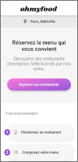

# P3: HTML, SASS & CSS animation / Ohmyfood website

## Project's presentation

Ohmyfood! is a young startup that would like to impose itself on the catering market. The goal is to develop a 100% mobile site that lists the menus of gourmet restaurants. In addition to traditional reservation systems, customers will be able to compose their meal menu so that the dishes are ready when they arrive. No more waiting times at the restaurant!

This project does not include functional elements, it is only **HTML and SCSS** formatting.
**CSS animation** is improved. It is mobile, tablet and desktop **responsive**.
